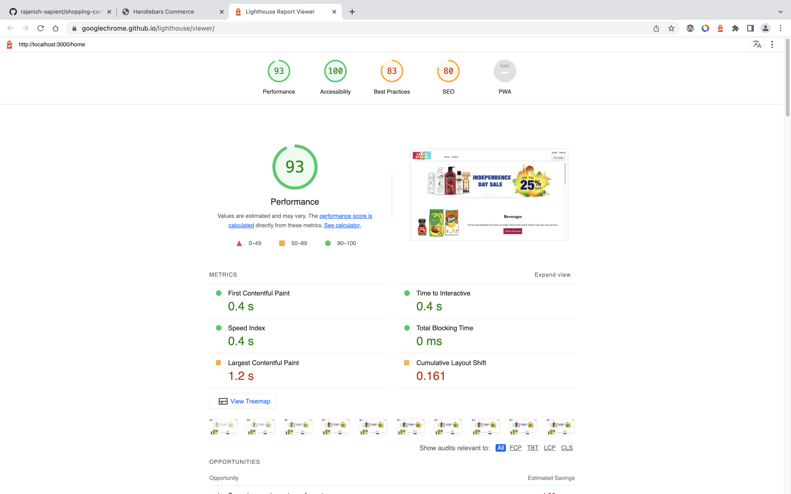

# XT Shopping Cart Assignment Using Javascript and Handelbar js

This is the client side code for the shopping cart.
It is created using vanila javascript and handebar js template engine .

## Technology Description

    This web application is a SPA(Single Page Application)
    Webpack is configured to achive the code bundling ,it also providing a  runtime dev enviroment.
    handelbar loader and bable loader configure in the webpack for templating and transpiling purpose.

Please follow the below steps to start the project

Go to the Client Folder  
Run the following command 
    npm install (For install the library) 
    npm run start / npx webpack serve (To run the application in devlopment mode) 
    npm run build /npx webpack (To build the project and create bundel in the Public folder) 

## Performance report

    Performance of the appliaction capured by the lighthouse chorme tools
    find the screenshot of the lighthouse report

 