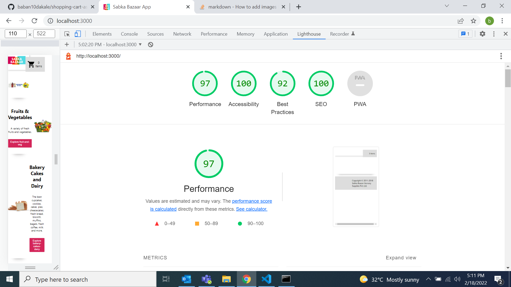

# Lighthouse




# XT Shopping Cart Assignment

This is the base folder for the shopping cart exercise. You will have all the static assets and mock server responses available in this repo.

## Getting Started

Clone this repo and run following command for starting the mock server:

```
npm install
npm run start
# or
yarn install
yarn start
```
