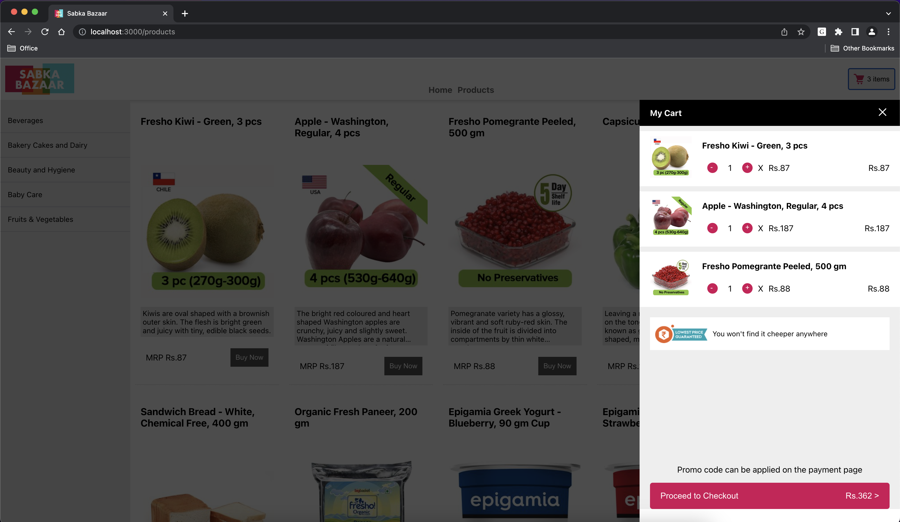
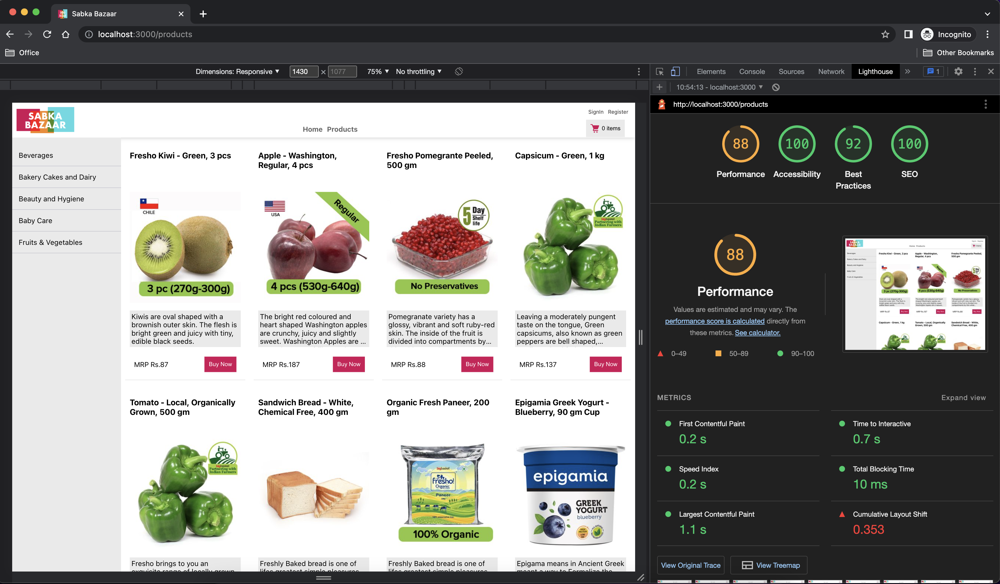

# Sabka Bazaar

## Start client app

Go to client folder

`cd client`

Install all the dependencies

`yarn install`

start the server

`yarn start`

## Start server

`yarn start` in the root of server folder

# Screen shots

Products and Cart Page

Lighthouse results

